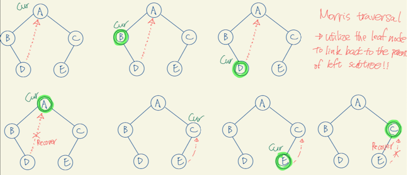

# Algorithm notes

## Binary search

- normally, use `std::binary_search`, `std::lower_bound`, `std::upper_bound` - check [notes :notebook:](https://github.com/orbuluh/cpp/blob/main/notes/binary_search.md)
- From the above 3 std functions, you can see there is 3 cases:
  - (1) `std::binary_search` - whether target exist
  - (2) `std::lower_bound` - what's the first occurrence of value >= target - e.g. **first occurrence** of target
  - (3) `std::upper_bound` - what's the first occurrence of value > target - e.g. previous is the **last occurrence** of target

**Implement by yourself**

- The key to code binary search by yourselves is to **implement it as case (2) or (3), but not (1)**
  - e.g. **think binary search as a binary insert problem instead**
  - WHY? Because (2) or (3) has only one answer, while (1) could have multiple.
  - And because (1) could have multiple result, the implementation is easy to get wrong!
- So how to do it in binary insert way? - check [here :dart:](../binary_search/first_and_last_pos_of_tgt_in_arr.h)

**Key 1: we want to make sure we don't go into infinite loop. How?**

- when you do `while (l < r)` ... and if ...
  - mid bias to `l`, e.g. `mid = l + (r - l) / 2`, then moving `r = mid` is guaranteed to be okay as `mid` can't equal to `r`
  - mid bias to `r`, e.g. `mid = l + (r - l + 1) / 2`, then moving `l = mid` is guaranteed to be okay as `mid` can't equal to `l`

**Key 2: when to bias what?**

- when do we need to bias to `l`? When we try to find the first occurrence (case 2)
  - Why? when we try to find the first occurrence, we want to always decrease `r` when `value >= target`.
  - And because it's first occurrence, mid itself could equal to target. So we basically want to make r = mid when `value >= target`
  - To ensure `r = mid` won't be an infinite loop, we have to "left bias" so mid will always not equal to `r`
- when do we need to bias to `r`? When we try to find the last occurrence (case 3)
  - Why? the same, we want to increase `l` when `value <= target`.
  - And because `l` itself could be result, we want to make `l = mid` when `value <= target`
  - To ensure `l = mid` won't be an infinite loop, we have to "right bias" so mid will always not equal to `l`

**Key 3: what to return?**

- when we bias to `l`, `mid` will eventually equal to `l` when loop break, which is the value we want to return.
- vise-versa, when bias to `r`, we want to return `r`

## Dynamic programming

- DP's goal is finding **overlapping sub-problems** that can be memorized.
  - To memorize the sub-problems, each of them is basically a "DP state" (a.k.a optimal substructure), where the state is represented by parameters.
- You need to think about what parameters could contribute a **"unique" state.**
- The state, or the result of a subproblem need to be unique:
  - It should not matter where you come from. If you reach state with specific set of parameters, the result is the same.
  - As it's unique, you can memorize it and return without recomputing in constant time - which is what DP is about, **optimizing a brute-force search such that the overlapped subproblem isn't recomputed through memorization.**
- The main difference between DP and divide and conquer is that DP tries out multiple choices of smaller subproblems, subproblems generally recur across different recursive calls.
  - In most divide-and-conquer algorithms, all the subproblems are distinct and there’s no point in caching their solutions.
- Another way to think about DP is: **Suppose someone handed us an optimal solution to us. What must it look like?**
- [Nice video](https://youtu.be/aPQY__2H3tE) with its five steps of solving DP:

```markdown
1. Visualize subproblems (should be a acyclic graph)
2. Find appropriate subproblems
3. Find relationships among subproblems
4. Generalize the relationships
5. Implementing by solving subproblems in order.
```

## Backtracking

- 3 main components
  - **choice**: decisions to make in each step
  - **constraints**: your decision is restricted somehow
  - **goal**: eventually converge to a goal

**Backtracking v.s. DFS**

- Backtracking is something that happens during search, but it also refers to a specific problem-solving technique where a lot of backtracking is done. [src](https://stackoverflow.com/a/3156208/4924135)
  - The more specific usage refers to a problem-solving strategy that is similar to depth-first search but backtracks when it realizes that it's not worth continuing down some subtree.
  - a naive DFS blindly visits each node until it reaches the goal. Yes, it "backtracks" on leaf nodes. But a backtracker also backtracks on useless branches.
- Backtracking is DFS for implicit tree, while DFS is backtracking without pruning. [src](https://stackoverflow.com/a/17891070/4924135)
  - When the search space of a problem is visited by backtracking, the implicit tree gets traversed and pruned in the middle of it.
  - Yet for DFS, the tree/graph it deals with is explicitly constructed and unacceptable cases have already been thrown, i.e. pruned, away before any search is done.

## Morris traversal

- [implementation](../tree/inorder_morris.h)
- 

## Substring matching

- [KMP :notebook:](kmp.md)
- [Rolling hash :notebook:](rolling_hash.md)

## Graph

- check [:notebook:](graph.md)
