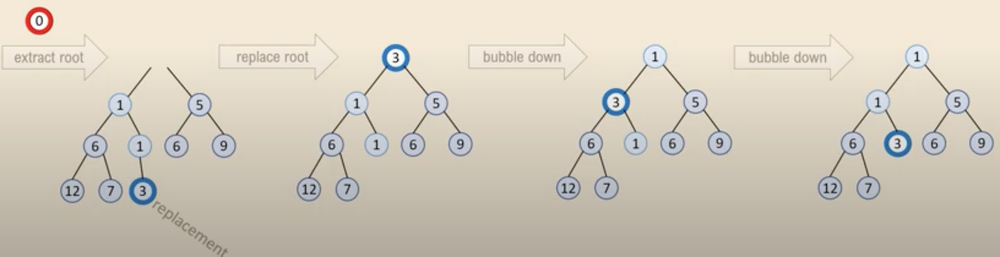
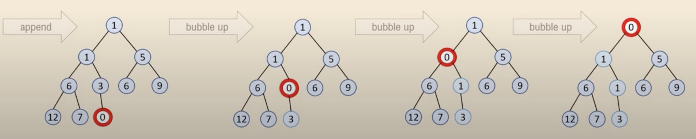
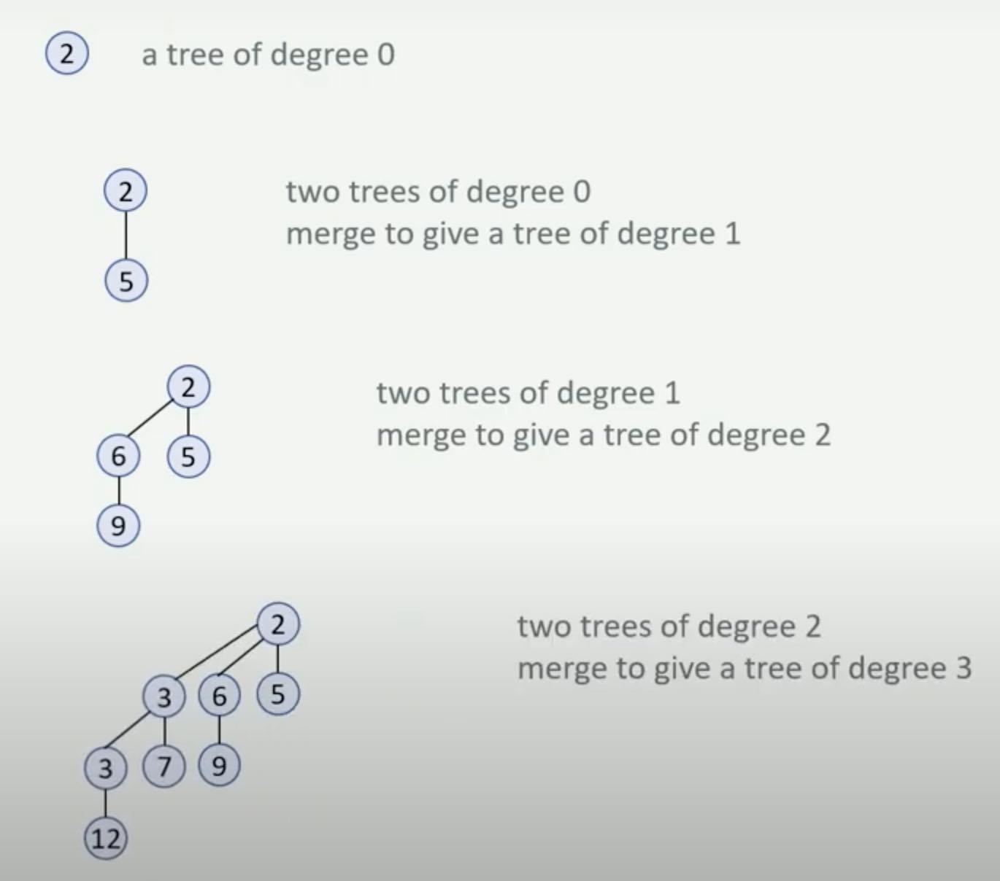
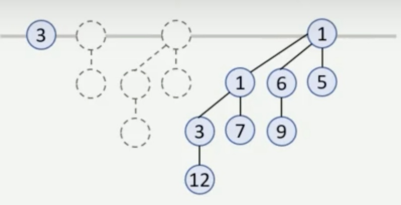
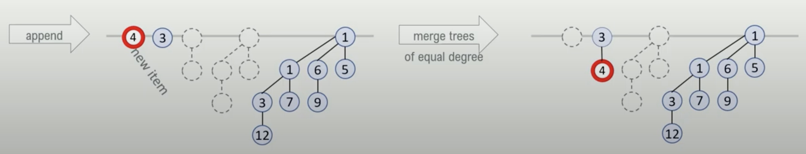
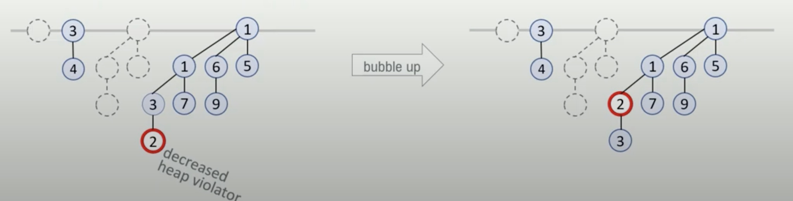

# Data structures: All kinds of Heap

from resources:
1. [Foundations of Data Science](https://youtu.be/FMAG0aunrmM)

## (Binary) heap

> Use minHeap as example for below

- Binary heap is a almost full binary tree (Tree height is $O(\log n)$).
- The tree maintain either **key(parent of node N) <= key(node N)**.
- **NOTE: Not left <= parent <= right.**

- `extractMin` is $O(\log n)$

- `insert` is $O(\log n)$

- `decreaseKey` is $O(\log n)$
  - Decrease key is basically like insert - you simply decrease the key and bubble it up.

**Heapify is $O(n)$ but HeapSort is $O(n\log n)$*

- e.g. it's faster if you heapify in batch then do it one by one.

**More about** [:link: `heapify`](https://stackoverflow.com/questions/9755721/how-can-building-a-heap-be-on-time-complexity)

- [siftDown and siftUp](https://youtu.be/5iBUTMWGtIQ)) are themselves O(log(n))
- The number of operations required for `siftDown` and `siftUp` is proportional to the distance the node may have to move.
- If we are going to choose either `siftdown` or `siftup`, we choose to `siftdown` (e.g. sift top node down), as tree has fewer node at the top, and more node at the bottom.
- notes from [src](http://www.cs.umd.edu/~meesh/351/mount/lectures/lect14-heapsort-analysis-part.pdf)

## Binomial heap

**Preliminary: binomial tree and its degree**

- The **degree** of binomial tree is basically the number of edges coming out of root.
- You concatenate 2 x (degree = d binominal tree) to form a degree = d + 1 binominal tree. (Through making one root node to the parent of the other tree's root).
- So degree = 0 has 2^0 node, degree = 1 has 2^1 nodes, ... degree = k has 2^k nodes

**A binomial heap is a collection of binomial tree**

- where each binomial tree is itself a heap (e.g. organize with the heap property)
- each degree of binomial tree can have **at most 1** in the whole structure
- Example: 1 x 0-degree binomial tree + 1 x 3-degree binomial tree in the binary heap below:

**The property**

- A degree=k binominal **tree** itself has 2^k nodes.
- A binomial **heap** is a collection of binomial **tree** with different degree. Say there are N nodes in binomial **heap**, then the binary representation of N basically tells you whether a degree of tree is presented.
  - For example, N = 5, 5 = 0b101, which means degree=0 and degree=2 binomial tree are presented in the N = 5 binomial heap
- Also, for a binomial **tree** of degree k,
  - The root itself has degree k
  - its k children are binomial trees as well
  - And the tree height is also k

**`insert` is $O(\log n)$**

- when insert, you basically pushing a 0-degree new binominal tree (BT), if there is a 0-degree BT, you try to merge the 2 x 0-degree BT to 1 x 1-degree BT. (The process goes on if there is already that degree of BT.)
- We create a degree=0 tree and then at most we need to merge all trees in the BT, and there are at most $O(\log n)$ trees, hence the complexity is $O(\log n)$

**`decreaseKey` is $O(\log n)$**

- `decreaseKey` is identical to normal binary heap, where you decrease the key value and bubble it up till the heap property is restored.
- When `decreaseKey`, the worst case is that we are decreasing the largest binomial tree's deepest node. A binomial heap's max degree is $O(\log N)$, (as binary representation of N shows whether the tree presents.), and binomial tree's height equal to its height, so we at most need to bubble $O(\log N)$ times for this worst case scenario.

`extractMin` is $O(\log n)$

- when extract, you basically find the min root amoung all degree of tree, pull it out. This makes that tree broke to several lower degree tree, then you just try to re-merge those lower degree tree, till the heap is valid again.
- There are $O(\log N)$ trees to scan to find the minimum. Then we need to promote $O(\log N)$ children from the tree with the minimum. Then we need to merge them with at most $O(\log N)$ times to recover the binomial heap.

**The amortized complexity of insert for binomial heap**

- **`insert` is actually $O(1)$ amortized** ... why? When you insert, you are actually like adding 1 into a binary representation of number N. So such operation at most flip $\log n$ bits, but every second operation is actually only adding one 0-degree tree without any merging ...etc

binomial heap only improved the amortized complexity of insert, but to speed up Dijkstra, we also need to do a lot of decrease key operations. Can we do better on this?

## Fibonacci heap

An extreme clever way to implement priority queue with amortized $O(1)$ to insert and decreaseKey.

**Structure of Fibonacci heap**

- store a list of trees, each is a heap
- trees can have any shape (not need to be binomial tree or some sort)
- Keeping track of the minRoot among all trees
- Overall a fibonacci heap is a collection of min-heap ordered tree

**The source of intuition**

- Check [here](https://youtu.be/FMAG0aunrmM?t=920) about the naive linked list implementation for speeding up decreaseKey and the [here](https://youtu.be/fRpsjKCfQjE?t=65) about how the previous implementation enlighten the fibonacci heap

**The proof of amortized analysis**

- TODO -> [here](https://youtu.be/RCCUrmklzjg)

**Common use cases**

- Mainly when we don't do much delete and extract-min (otherwise normal binary heap might be better)

1. minimum spanning tree
2. [SSSP: Dijkstra algorithm](graph_sssp.md)

|Operation|Fibonacci heap (amortized)| Binary heap (worst case)|
|--- | --- | --- |
|delete      | $O(\log n)$ | $\theta(\log n)$ |
|extract-min | $O(\log n)$ | $\theta(\log n)$ |
|---|
|make-heap   | $\theta(1)$ | $\theta(1)$ |
|min         | $\theta(1)$ | $\theta(1)$ |
|---|
|decrease key| $\theta(1)$ | $\theta(\log n)$ |
|union       | $\theta(1)$ | $\theta(n)$ |
|insert      | $\theta(1)$ | $\theta(\log n)$ |