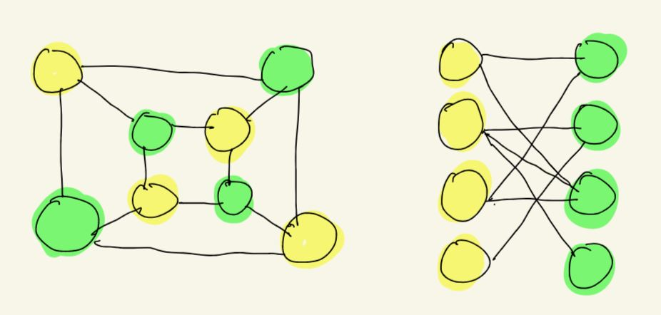
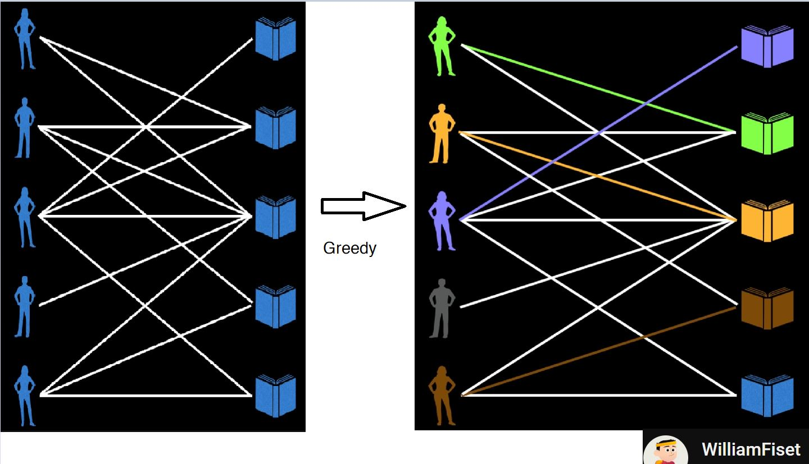
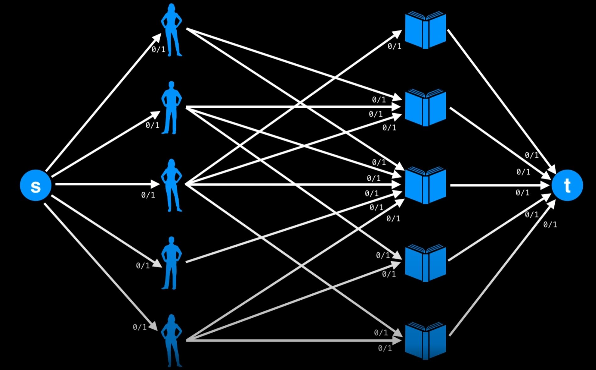
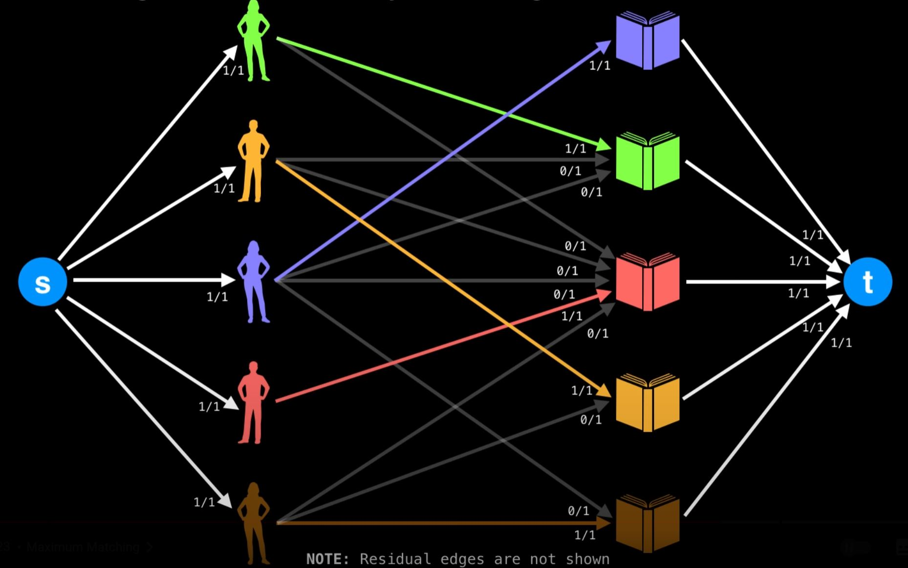
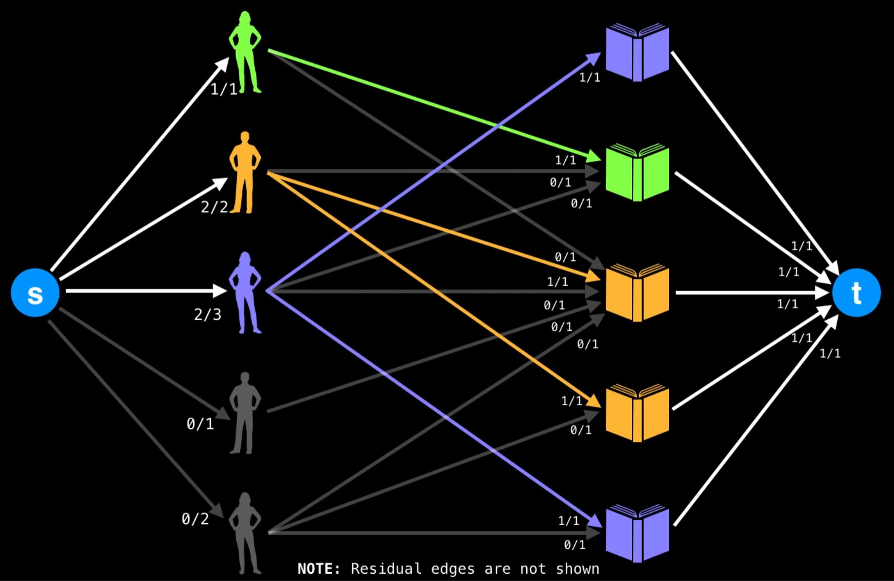
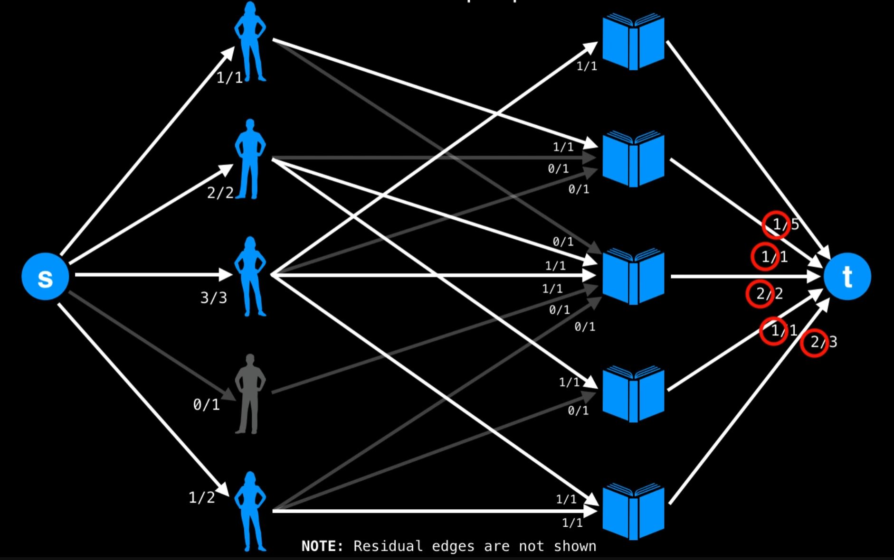

# Graph: 4. Bipartite

Notes from watching [WilliamFiset](https://youtu.be/GhjwOiJ4SqU)

**What**

- A bipartite graph is one whose vertices can be split into 2 independent groups U, V, such that every edge connects between U and V.
  - E.g. "every edge in the graph connects a node in set A and a node in set B."
  - E.g. "no edges between nodes in the same set in a bipartite graph"
- 
- [Question: is graph bipartite](../graph/README.md#💡-785-is-graph-bipartite-🎯)

**Why does it matters?**

- Consider a common matching scenario, where we have 5 people, 5 different books. Each of them can take 1 book, but each book only have 1 copy. How do we make most people to get a book?
  - 
- Can greedy find the optimal solution, like the graph show? The answer is actually no. So there is more about for this problem.
- The point is, such matching can be modeled as a bipartite graph, where people are in one set, and book are in another set.

**How do we solve the problem? :bulb: making it a** [max cut problem](graph_max_flow.md)

If apply the max cut/min flow and solve above converted flow graph, the answer is actually like:

Think about the capacity on the converted graph:

- The outward edges from sources are all having capacity 1, this models the fact that **each person can only take 1 book!**
- The inward edges toward sources are all having capacity 1, this models the fact that **each book has only 1 copy!**
- The edges between person to book are all having capacity 1, this models the fact that **each person can only take 1 copy of book!**

So with modifying the capacity of edges in the converted flow graph, you can actually deal with different variation of problem!

Problem variation 1: what if each person can take **more than one book**?

Problem variation 2: what if each person can take more than one book, and **there are multiple copy of each book**?

- Note: the flow on link toward sink basically shows how many copy has been taken in the optimal solution!

Problem variation 3: what if each person can take more than one book, and there are multiple copy of each book, plus **a person can take multiple copy for a certain book**?

- Then you change the middle edges' capacity to represent this!
