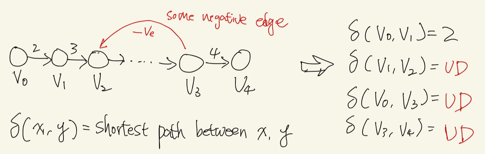

# Graph: 2. Single source shortest path / SSSP

[**Problem sets :link:**](../graph/graph_sssp/README.md)

**Resources**
Taking notes from

1. [MIT OpenCourseWare](https://youtu.be/2E7MmKv0Y24)
2. [WilliamFiset 1](https://youtu.be/pSqmAO-m7Lk)
3. [MIT OpenCourseWare](https://youtu.be/ozsuci5pIso)
4. [WilliamFiset 2](https://youtu.be/lyw4FaxrwHg)

## Generic structure of shortest path (SP)

> For a graph $G(V, E)$
>
> Initialize for $v \in V$:
> - $d[v] <- \infty$: stores length of current shortest path to $v$
> - $\Pi[v] <- NIL$: stores predecessor of $v$ in shortest path
> - $d[s] <- 0$: $s$ is source vertex
>
> Repeat:
> - select an edge somehow
>   - $Relax(u, v, w)$
> Until you can't relax an edge any more

---

> Relax(u, v, w):
> - if ($d[v]$ > $d[u] + w(u, v)$)
>   - $d[v]$ = $d[u] + w(u, v)$
>   - $\Pi[v]$ = $u$

---

**Proof of why $Relax(u, v, w)$ is correct/safe**

- Define:
  - $d[v]$ is length of the current shortest path from source $s$ to vertex $v$
  - $\delta(s, v)$ is the length of **a** shortest path from source $s$ to vertex $v$
    - (so all $d[v]$ should eventually converge to $\delta(s, v)$)
  - $\Pi(v)$ is the predecessor of $v$ in shortest path from source $s$ to vertex $v$

> Lemma: The relaxation operation maintains the invariant that $d[v] \geq \delta(s, v)$ for all $v \in V$

- It's saying that, if you have an algorithm that uses relaxation, and that's the only you update the $d[v]$, then you must converge eventually. And you are not going to get a wrong shortest path value at any given timing of the execution of the algorithm.
- E.g. **the sequence of relax operations doesn't matter.**
- This tells us that we can create the generic structure of shortest path algorithm - pick an edge, relax it, pick another, relax it, and eventually will work out and you will get your correct $\delta(s, v)$ eventually.
- The lemma ensures that you are never going to get something in the middle that is less than the eventual $\delta(s, v)$. And if you run enough time, depends on your heuristic of selecting the edges to relax, the generic shortest path algorithm should terminate and give you the result (hopefully) in polynomial time.

- By triangle inequality, we know $\delta(s, v) \leq \delta(s, u) + \delta(u, v)$
  - Note - $\delta$ only means the **eventual length** of shortest path between 2 points, it doesn't matter how much hops in between.
- By induction, our hypothesis: $d[u] \geq \delta(s, u)$
- Substitute hypothesis into triangle inequality:
  - $\delta(s, v) \leq \delta(s, u) + \delta(u, v)$,
  - $\delta(s, v) \leq d[u] + \delta(u, v)$
- And because $\delta(u, v)$ is the shortest path between $u$ and $v$, and $w(u, v)$ is the single edge directed way to go from $u$ to $v$, this most hold: $\delta(u, v) \leq w(u, v)$, so substitute to above
  - $\delta(s, v) \leq d[u] + w(u, v)$, and right hand side is basically $d[v]$ in relaxation, so we get
  - $\delta(s, v) \leq d[v]$
  - e.g. we prove the lemma!

## Shortest path in DAGs

**Directed acyclic graphs (DAGs)**

- we can have negative edges, but can't have negative cycle. (Only negative cycle will make shortest path undefined.)

**Method to find SP**

1. Topological sort the DAG. (Complexity: O(V+E))
2. One pass over vertexes in topologically sorted order, relaxing each edge that leave each vertex. (Touch each vertex once and each edge once, also O(V+E))

The algorithm overall takes O(V+E) - why? because you are relaxing each edge from each vertex. Overall you only check each edge once.

Side notes: after getting the topological order, you can just start from the source point that you want. So the vertexes that is before source point in topological order will just be ignored.

## Dijkstra Algorithm

> The intuition is that using the generic framework, with a greedy heuristic to construct the shortest path.

- An SSSP algorithm for  non-negative edge weights.
  - This ensures once a node is visited, its optimal path can not be improved further by taking an edge through negative weight.
  - Basically ensure the algorithm can act with greedy manner to always select the most promising node.

**Pseudo code**

> Initialize
> - $d[s] = 0$
> - $S = \phi$: an empty set to store the vertex that has been traveled
> - $Q = \{ (d[s], s) \}$: a min priority queue store pair of ($d[s], s$)

> while $Q \neq \phi:$
> - $u$ = EXTRACT_MIN($Q$)
> - $S = S \cup \{ u \}$
> - for each $v \in neighbor[u]:$
>   - $Relax(u, v, w)$

**The complexity**

- $\theta(V)$ inserts into queue
- $\theta(V)$ extract from priority queue
- $\theta(E)$ while relax, you decrease the $d[v]$ for a vertex

Assume it's normal heap / priority queue:

- Outer while loop is O(V)
- $\theta(log(V))$ for EXTRACT_MIN, and you extract $\theta(V)$ times
- $\theta(log(V))$ for decrease/update key, and you do this for each edge, $\theta(E)$ times
- So overall: $\theta(V log(V)) + \theta(Elog(V))$ = $O((E+V)log(V))$

**Building path from Dijkstra**

- Based on above algorithm, keep another array to keep track of the previous node to a current node in dist . Then we could reconstruct the shortest path accordingly.

**Early termination if you just need to reach to specific target node**

- Dijkstra processes each next most promising node in order.
- So if the target node have been reached, its shortest distance will not change as more future nodes are visited.

**Optimization for dense graph**

- **Indexed Priority Queue (IPQ)**
  - The original algorithm insert all the feasible (`distance`, `nodeIdx`) pair in `O(log(n)`, and “lazily” remove stale edges in PQ.
  - When doing this, one `nodeIdx` could have several entires in the PQ, with different value of distance.For dense graph, this would be costly.
  - The “eager” version of Dijkstra **avoids duplicated key-value pairs** and support efficient updates by using IPQ.
  - The difference of using IPQ is that for the same `nodeIdx`, whenever we saw a smaller `distance`, we can simply update the `distance` in the entry instead of making duplicated `nodeIdx` entries in the PQ.

- **D-ary heap for the IPQ**
  - In the context of Dijkstra on dense graph, there are more updates (i.e. `decreaseKey` operation) than `dequeue` operations.
  - A D-ary heap where a node having D children would be more feasible than general binary heap for IPQ. This speeds up decrease key operations at the expense of more costly removals.
  - Ideally improving the whole complexity to `O(E * log(V))` to `O(E * log_{E/V}(V))`

**Side note: ["Is Dijkstra's algorithm just BFS with a priority queue"](https://cs.stackexchange.com/questions/10047/is-dijkstras-algorithm-just-bfs-with-a-priority-queue)**

> You can implement Dijkstra's algorithm as BFS with a priority queue (**though it's not the only implementation**).
> - Dijkstra's algorithm relies on the property that the shortest path from s to t is also the shortest path to any of the vertices along the path. This is exactly what BFS does.
> - Or in another perspective: how would Dijkstra's algorithm behave if all the weights were 1? Exactly like BFS.
> - From [best answer](https://cs.stackexchange.com/a/10048/150744)

- check [related problem that looks like normal grid walking with BFS but you can think it as a variation of Dijkstra](../graph/graph_sssp/README.md#grid-walking-using-dijkstra-dijkstras-algorithm-is-bfs-with-a-priority-queue)

 

---

 

## Bellman Ford Algorithm

**Quick fact**

- BF is generally not ideal for most SSSP problems because it has a time complexity of $O(EV)$.
- It is better to use Dijkstra’s algorithm, which has $O((E+V)log(V))$ when using a binary heap priority queue.
- When do we use BF then? When Dijkstra fail **because a graph has negative weights.**
- BF can detect negative cycles and determine when they occur.

**What does BF want to do?**

- if negative cycle exists, the path connected to any node on the negative cycle has an undefined shortest path.
- otherwise, it should output the shortest path with fewest node.

**Pseudo code**

For a graph $G(V, E)$
Initialize for $v \in V$:
- $d[v] <- \infty$: stores len of shortest path to $v$
- $\Pi[v] <- NIL$: stores predecessor of $v$ in shortest path
- $d[s] <- 0$: $s$ is source vertex

for $iteration$ in range($|V| - 1$)
  - for each $edge(u, v) \in E$
    - $Relax(u, v, w)$

for each $edge(u, v) \in E$
  - if $d[v] > d[u] + w(u, v)$
    - Report negative cycle

**Complexity**

- $O(VE)$, where $E = O(V^2)$, hence overall $O(V^3)$

**The intuition and proof**

- Say there exists a shortest path from $v_0$ to $v_k$ with $x$ vertex in the path, then $maximum(x) = |V| - 1$
- Why? because if it's more then $|V| - 1$, it must create cycle for a graph with only $|V|$ nodes!

> **Theorem**: If $G = (V, E)$ contains no negative cycle, then BF must find $d[v] = \delta(s, v)$ for all $v \in V$, where $\delta(s, v)$ is the shortest path from $s$ to a vertex $v$

Let $v \in V$, $p = <v_0, v_1, ..., v_k>$, and $v_0 = S$, $v_k = v$.

- Then this path $p$ is **a** shortest path with minimum number of edges.
- (Note the a, not the, because there could have several shortest path from $S$ to $v$, but we only want to find the one with minimum nodes.)
- No negative cycle implies $p$ is simple, and $k \leq |V| - 1$
- For such path $p$, since it's simple shortest path, for any 2 points $x$, $y$ on the path, their edge($x$, $y$) must be a partial of shortest path as well.
- As the algorithm initialize $d[S] = 0$, you can imagine in each iteration, as you check all the edges, you are just going to find one more edge from source that is on the shortest path. So proof by induction:

  - After 1 iteration, we have $d[v_1] = \delta(s, v_1)$ because we will relax $edge(v_0, v_1)$ in this iteration
  - After 2 iteration, we have $d[v_2] = \delta(s, v_2)$ because we will relax $edge(v_1, v_2)$ in this iteration
  - ...
  - After k iteration, we have $d[v_k] = \delta(s, v_k)$
  - After $|V| - 1$ iteration, all reachable (from $S$) vertexes must have their shortest path $\delta$ values.

> **Corollary**: If a value $d[v]$ failed to converge after $|V| - 1$ passes, then there must exists a negative cycle **reachable from the source $s$**

- After $|V| - 1$ iterations, if we find an edge that can be relaxed, that means current shortest path from $S$ to some vertex $v$ is not simple, e.g. there must exist repeated vertex in the path. 
- And because it has repeated vertex in the path, we find a cycle.
- And this cycle must be a negative weight cycle because I was able to relax the edge and reduce the weight after I added this vertex that causes a cycle.

**Side note**

- BF can either report the shortest path when there is no negative cycle, or report the existence of the negative cycle.
- If you are asking to "not walk the cycle" and report such shortest path, it becomes an NP-hard problem. And this problem is equivalent to find the longest path (which is also, NP-hard).

