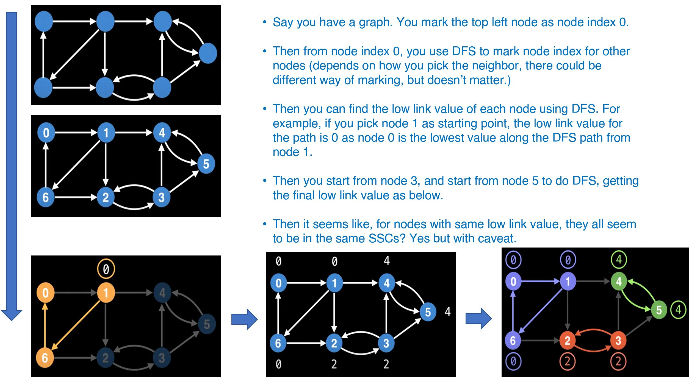
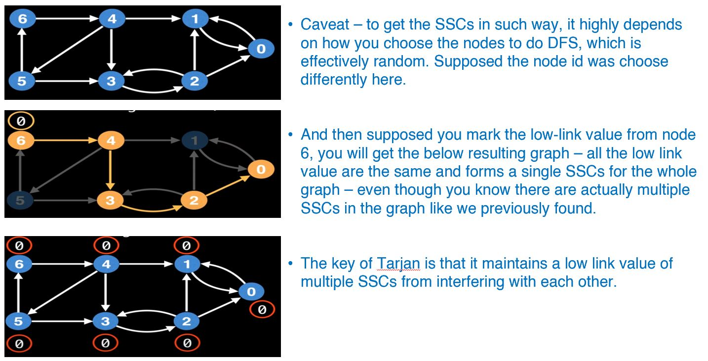

# Graph: 6. Tarjan's Strongly Connected Component

**Resources**
Taking notes from

1. [WilliamFiset](https://youtu.be/wUgWX0nc4NY)
2. ChapGpt

**What is strongly connected component?**

- A strongly connected component (strongly connected component) in a directed graph is a subset of vertices such that there exists **a directed path from every vertex in the subset to every other vertex in the subset.**
- In other words, uou can think of SCC as "self-contained cycles" within a directed graph where all vertices in a given cycle can reach every other vertex in the same cycle (e.g. mutually reachable).

**Property of SCCs in a graph**

- A graph can have multiple SCCs, each consisting of a different set of vertices. However, the set of SCCs in a graph, which is **the collection of all SCCs in the graph, is unique.**
- This is because SCCs are defined as subsets of vertices that are mutually reachable by directed paths. Any two SCCs in a graph must be disjoint, meaning they do not share any vertices in common, and the union of all SCCs must be the entire set of vertices in the graph.
- Therefore, the set of SCCs in a graph is unique because it fully characterizes the graph's connectivity structure, regardless of how the vertices are partitioned into SCCs.
- E.g. SCCs in a graph are not necessarily unique, but the set of SCCs in a graph is unique.

**Intuition and the caveat**

- If you use DFS from a node and being able to traverse back to itself, then all the nodes on the DFS path should form a SCC.
- Also, you can basically start from **any** nodes in the SCC, and then reach back to itself.
- To keep tracking of the DFS and the visited nodes, we will make sure we mark each vertices with node index.
- For a DFS path starting from a random node, we maintain a low-link value, which is the **lowest node index (a.k.a. earliest discovered node) you can find along the path**
- then for all nodes with same low-link value, they should form a SCC.

- However, there is caveat of doing so - it's only correct if you happen to mark the node id in the right way and select the correct order to traverse.

- To cope with the random traversal order of the DFS, Tarjan's algorithm maintains a stack/set of valid nodes from which to update low-link values from.
  - Nodes are **added** to the stack/set of valid nodes as they're explored by DFS **for the first time.**
  - Nodes are **removed** from the stack/set **each time a complete SCC is found.**
- **New low-link update condition**
  - If `u` and `v` are nodes in a graph and we're currently exploring `u` then our new low-link update condition is that:
  - To update node `u`'s low-link value to node `v`'s low-link value, there has to be a path of edges from u to v **and node `v` must be on the stack.**
  - E.g. The algorithm then updates the low-link value of the node by comparing its index with the low-link values of its neighbors that have already been visited.

**Rationale of update low-link value**

- By comparing neighbor's low-link value, we can identify the earliest node in the current SCC that was discovered during the DFS traversal.
- The low-link value of a node is updated whenever the algorithm encounters a neighbor that has already been visited, **indicating the presence of a back edge in the graph**.
- The low-link value is set to the minimum of the current node's index and the low-link value of the neighbor, indicating that the current node can reach the same set of nodes as its neighbor.
- By keeping track of the lowest low-link value encountered for each SCC root, the algorithm can group together all nodes that belong to the same SCC.
- When the algorithm encounters a node that is the root of an SCC, it pops all nodes from the stack until it reaches the root node and assigns them to the same SCC. **This ensures that all nodes in an SCC are correctly identified and grouped together.**
- By doing so, you can ensure correctly find the SCCs in the graph, but why?

**Proof**

- To prove the correctness of Tarjan's Strongly Connected Components (SCC) algorithm, we need to show two things:
  - The algorithm correctly identifies all SCCs in the graph.
  - The algorithm does not identify any SCCs that do not exist in the graph.

- To prove the first point, we can argue that the algorithm correctly identifies SCCs
  - because it follows the definition of SCCs, which is a subset of vertices in which all vertices are mutually reachable by directed paths.
  - Specifically, the algorithm uses a DFS traversal of the graph to identify SCCs by maintaining a stack of vertices that have been **visited but not yet assigned to a SCC**.
  - It also keeps track of the lowest DFS index (e.g. low-link value) that can be reached from each vertex in the DFS tree. As the DFS traversal progresses, the algorithm assigns vertices to SCCs based on their low-link values.
  - If a vertex's low-link value is equal to its DFS index, then it must be the root of a SCC. The algorithm pops all vertices from the stack until it reaches the root, and assigns them to the same SCC.
  - This process ensures that **all vertices in a SCC are eventually assigned to the same SCC by the algorithm.**
- To prove the second point, we need to show that the algorithm does not identify any SCCs that do not exist in the graph.
  - This can be done by showing that the algorithm only assigns vertices to SCCs based on the low-link values that are computed during the DFS traversal, and that **these low-link values accurately reflect the connectivity of the graph.**
  - Specifically, the low-link value of a node is the minimum of its own discovery time and the low-link values of its neighbors that have not yet been assigned to a SCC.
  - This means that **the low-link value of a node can only decrease as the DFS traversal progresses, and that it accurately reflects the earliest discovered node that can be reached from that node along a path that does not traverse any back edges.**
    - (Any edges that lead from a node back to a previously visited node are called **back edges**, and they represent cycles in the graph.)
  - Since SCCs are defined based on the connectivity of the graph, and the low-link values computed by the algorithm accurately reflect the connectivity of the graph, the algorithm cannot identify any SCCs that do not exist in the graph.

- Therefore, we can conclude that Tarjan's SCC algorithm correctly identifies **all SCCs in the graph and does not identify any SCCs that do not exist in the graph, making it a correct algorithm for finding SCCs in directed graphs.**

**Overview of Tarjan's algorithm**

- Mark the id of each node as unvisited
- Start DFS on random node. Upon visiting a node, assign it an id and a low-link value. Also mark current nodes as visited and add them to a seen stack.
- On DFS callback, if the previous node is on the stack, then min the current node's low-link value with the last node's low-link value.
- After visiting all neighbors, if the current node started a connected component,  then pop nodes off stack until current node is reached. (A node started a connected component if its id equals its low link value)
- Running example in [WilliamFiset video](https://youtu.be/wUgWX0nc4NY?t=442)