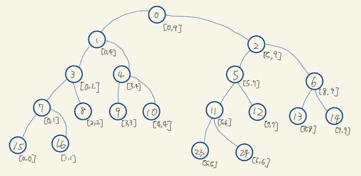
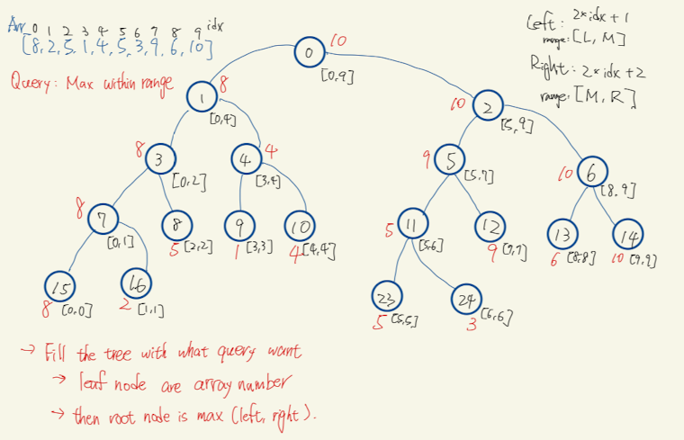
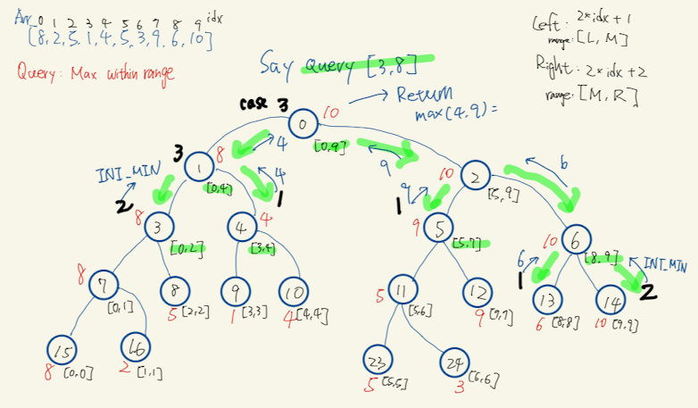

# Segment tree
- Original taking notes from watching [YT video](https://youtu.be/-dUiRtJ8ot0)

## Use case - A query about an range
### Example: query maximum within range
- Say you have an array of integers. User will query with a range [l, r]
- You need to return the maximum between [l, r]
- Naively, if you iterate l to r for each query to find the maximum, every query is a O(n) search.
- Segment tree reduce this query to O(logn)

### Example 2: Range query

## Basic tree representation
- say root node idx is `i`
  - left node idx is `2 * i + 1`
  - right node idx is `2 * i + 2`
- root node represents range within [L, R]
  - M = L + (R - L) / 2
  - left node represents range within [L, M]
  - right node represents range within [M+1, R]
- Overall - leaf node will basically represents the original input, which has a range of l == r

## How to build the tree
- Build is based on the query - For example, query the max of a range:

- Check [this question](../segment_tree/range_sum_query_mutable_segmenttree.h)

## How to update the tree
- Overall very similar how to build the tree. The difference when we update, we only need to either update left or right, depends on whether the updated node is before mid or after.
- Check [this question](../segment_tree/range_sum_query_mutable_segmenttree.h)

## How to query
- Return value is based on the query of the range.
- The main idea is that each siblings are having mutual exclusive range. So it's about how to traverse the tree and composite the full range.
  - **Case 1**: query range **completely covered** by the node range: `return node value`
  - **Case 2**: query range **out side of** node range: return a value represents out of bound.
    - For example:
      - `return INT_MIN` if finding max
      - `return 0` if finding range sum.
  - **Case 3**: query range **(partial or full) overlap with** node range: return a value represents within the range
    - `return min(left, right)` if finding range max
    - `return sum(left, right)` if finding range sum
- Check [this question](../segment_tree/range_sum_query_mutable_segmenttree.h)

## Size of segment tree node array: $O(4n)$
- Say full range is n, which means leaf nodes is at least n
- Say N is the min of pow of 2 that >= n, e.g. N = $2^{\lceil log_2{n} \rceil}$
- Since segment tree is a complete tree, the hight of tree should be $h = \lceil log_2{N} \rceil + 1$
- The maximum number of nodes in a complete binary tree is $2^(h) - 1$
- So the size needed equal to $2^{log_2{N} + 1} - 1$ = $2 * 2^{log_2{N}} - 1$ = $2 * N - 1$
- As $N <= 2 * n$, size needed will be $2 * 2 * n - 1$ = $O(4*n)$

## Question collection
- :point_right: [:notebook:](../segment_tree/README.md)