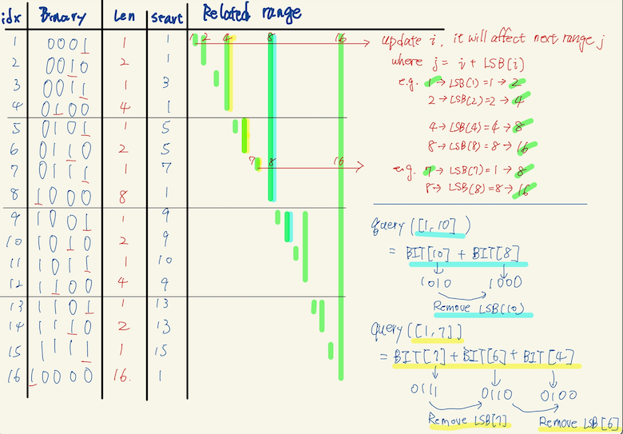

# Binary indexed tree
- a.k.a Fenwick Tree
- Taking notes from:
  - [Chandan Mittal](https://www.hackerearth.com/practice/notes/binary-indexed-tree-or-fenwick-tree/)
  - [WilliamFiset YT](https://youtu.be/BHPez138yX8)
  - [Malomalomalomalo's blog](https://codeforces.com/blog/entry/57292)
  - [Algorithms Live! YT](https://youtu.be/kPaJfAUwViY)

## Basic idea
- For a given array of size N, we can maintain an array BIT[] such that, at any index we can store sum of **some numbers** of the given array.
- BITs take advantage of the fact that **ranges can be broken down into other ranges, and combined quickly**.
- Basically, if we can precalculate the range query for a certain subset of ranges, we can quickly combine them to answer any [1,x] range query.

## The "binary indexed"
- The clever way of utilizing the array index to represent "range" in BIT is through arranging on least significant bit (LSB)
- For index i,
  - the LSB(i) represents the length of the range, e.g. how much it responsible below and includes i
  - This is the critical part to form the range query, check [session below](#query-the-tree)
  - (check [graph below](#overall-structure))
- (We exclude zero as its binary representation doesn't have any ones. So LSB pattern above doesn't apply.)

- For examples:
  - index 1 (001) has LSB at 1, range length: 1. So it covers previous 1 element, range [1 - 1 + 1, 1] = [1, 1]
  - index 2 (010) has LSB at 2, range length: 2. So it covers previous 2 elements, range [2 - 1 + 1, 2] = [1, 2]
  - index 3 (011) has LSB at 1, range length: 1. So it covers previous 1 element, range [3 - 1 + 1, 3] = [3, 3]
  - index 4 (100) has LSB at 4, range length: 4. So it covers previous 4 elements, range [4 - 4 + 1, 4] = [1, 4]
  - index 5 (101) has LSB at 1, range length: 1. So it covers previous 1 element, range [5 - 1 + 1, 5] = [5, 5]
  - index 6 (110) has LSB at 2, range length: 2. So it covers previous 2 elements, range [6 - 2 + 1, 6] = [5, 6]
  - index 7 (111) has LSB at 1, range length: 1. So it covers previous 1 element, range [7 - 1 + 1, 7] = [7, 7]

- Generalize: at BIT[i] stores the cumulative sum from the index [i - lsb(i) + 1, i]  (both inclusive).

### Trick to isolate the least significant bit: `x & (-x)`
- [Check :notebook:](bitwise.md#trick-to-isolate-the-least-significant-bit-x---x)

## Overall structure
- Space Complexity: O(N) for declaring another array of size N
- Implementation details check [this question :dart:](../range_query/binary_indexed_tree/range_sum_query_mutable_binary_indexed_tree.h)
  - Some details about how we ignore index 0, and how to construct/update.


## Construct the tree
- From the graph, you will see a number is actually covered by multiple ranges
  - For example: elements 7 is included by BIT[7] (0111), BIT[8] (1000), BIT[16] (10000)
- So think it in another direction - when you update element 7, you should have updated all the ranges including 7
- But how? When you update BST[i], you can find the next affected range BST[j] through
  - `j = i + LSB(i)`
- For example:
  - BIT[7] with LSB(7) = 1, so next affected one is 7 + 1 = 8
  - BIT[8] with LSB(8) = 8, so next affected one is 8 + 8 = 16
```cpp
void update(int x, int valDelta) {
    for (; x <= n; x += (x & -x)) { // keep adding LSB(x) till exceed
        BIT[x] += valDelta;
    }
}
```
- Implementation details check: [this question :dart:](../range_query/binary_indexed_tree/range_sum_query_mutable_binary_indexed_tree.h)

## Query the tree
- Recall that BST[i] is responsible for range i and LSB(i) range below i.
  - For example, BST[10] has LSB(10) = 2, so BST[10] take care of range [9, 10]
- So think this in another way - if you want to find the non-overlapping range `j`,
  you can actually find it through `j = i - LSB(i)`

- Say we want to query Range(1, x), then the algorithm is:
```cpp
int query(int x) // returns the sum of first x elements in given array a[]
{
    int sum = 0;
    for (; x > 0; x -= (x & -x)) // e.g. keep resetting LSB(x)
        sum += BIT[x];
    return sum;
}
```
- e.g. query(1, 10) = BST[10] + BST[8]
  - LSB(10) = 2, so next we find LSB(10 - 2), e.g. 8
  - LSB(8) = 8, so next we find LSB(8 - 8) = 0. e.g. loop finish
- the loop iterates at most the number of bits in x, so the query operation takes O(log2(n))
- Implementation details check: [this question :dart:](../range_query/binary_indexed_tree/range_sum_query_mutable_binary_indexed_tree.h)


##  The "binary indexed" property
- With how the index is used to represent a range, it can be proved that ...
  - (P.1) Every range [1,x] is constructable from the intervals given
  - (P.2) Every range decomposes into at most log N ranges.
  - (P.3) Every index is included by at most log N intervals.
- Proof listed in  [article](https://codeforces.com/blog/entry/57292)
