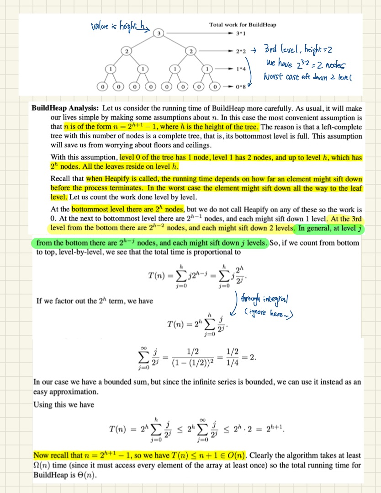

# Data structures

## Heap

**Quick facts**

- The tree maintain either parent >= child or parent <= child. **Not left <= parent <= right.**
- **Heapify is O(n)**
- insert is O(log(n))
- HeapSort is O(nlog(n))

**More about** [:link: `heapify`](https://stackoverflow.com/questions/9755721/how-can-building-a-heap-be-on-time-complexity)

- [:link: siftUp/siftDown animation](https://youtu.be/5iBUTMWGtIQ)
- siftDown and siftUp are themselves O(log(n))
- The number of operations required for siftDown and siftUp is proportional to the distance the node may have to move.
- If we are going to choose either siftdown or siftup, we choose to siftdown (e.g. sift top node down), as tree has fewer node at the top, and more node at the bottom.
- notes from [src](http://www.cs.umd.edu/~meesh/351/mount/lectures/lect14-heapsort-analysis-part.pdf)

## tree like DS are sorted by keys `map`, `set`, `multimap`, `multiset`

- Key is ascending sorted by default - e.g. comparator is `std::less<T>` by default.
  - To make it descending, could do something like `std::map<int, int, std::greater<int>> m;`;
- If the keys are constant-pointers-to-characters, the map is sorted by the key pointers, and not by the key string literals.
- If the keys are `std::string`, it is lexicographically sorted.

## BST

- binary search tree is a binary tree in which every node fits a specific ordering property:
  - `all left descendents <= n < all right descendents`. This must be true for each node `n`.
  - (or) `all left descendents < n <= all right descendents`
- Note that this **inequality must be true for all of a node's descendents, not just its immediate children**

## [Binary index tree (BIT)](binary_index_tree.md)

## [Segment tree](segment_tree.md)

## Monotonic Queue/Stack

- A **monotonic** queue/stack: the elements from the front to the end is strictly either increasing or decreasing.
  - -> monotonic increasing `[1, 2, 3, 4, 5]`
  - -> monotonic decreasing `[5, 4, 3, 2, 1]`
- The way to maintain such relationship is keep pop'ing the invalid one.
- Say we want a monotonic increasing queue/stack, every time we get a new value, we check whether stack.top() is larger than the new value. If it's larger, we need to pop it out, so when we push new value, the stack is still in an increasing way.
  - For example: originally [1, 4, 5],
    - If you are going to insert 3, then you pop 5 and 4 out, queue becomes [1, 3]
    - If you are going to insert 6, then you pop nothing, queue becomes [1, 4, 5, 6]
- What is this for? Check out [question set](../monotonic/README.md)
  - One example, for monotonic increasing queue, you will see that the front of the queue is always the minimum value.
  - So in the case that you need to find a fixed size k sliding window minimum, you can use monotonic increasing queue.
  - Vise versa, find a [fixed size k sliding window maximum](../monotonic/README.md#bulb-239-sliding-window-maximumhttpsleetcodecomproblemssliding-window-maximum-dartslidingwindowmaximumh), you can use monotonic decreasing queue.
