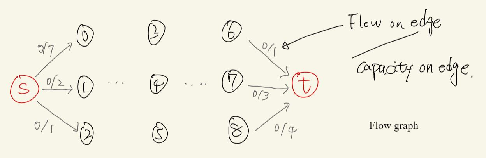
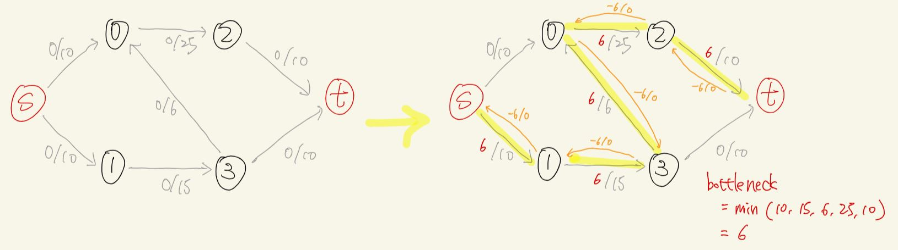
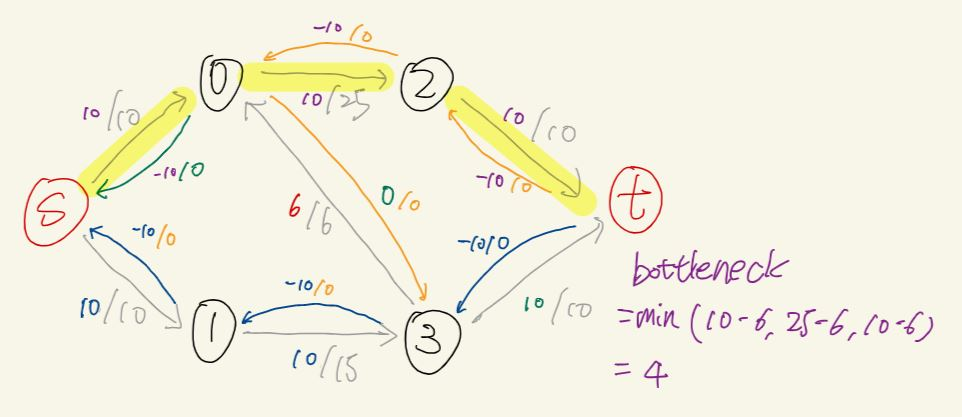
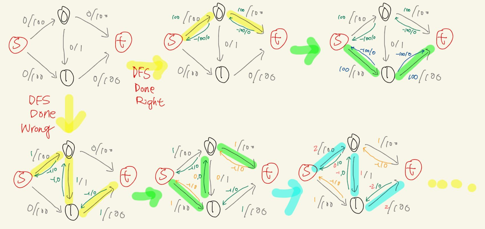

# Max flow / min cut / Ford-Fulker method

- From [WilliamFiset](https://youtu.be/LdOnanfc5TM)
- From [MIT OpenCourseWare](https://youtu.be/VYZGlgzr_As)

**What**

> "It's an optimization problem associated with the exact number that the flow all obey the edge capacity constraints"

**Why the problem is challenging?**

- You can imagine, an edge could be filled by flow from either of the neighbors. And among the whole graph, how do you find the way so that the overall maximum flow into the target is maximum while all the flow in each edge doesn't break the capacity constraint.
- For the flow on each edge, it's not monotonic increased like Dijikstra / Minimum Spanning Tree would do, sometimes you can try to decrease the flow from one edge, and making its original flow to be sent from some other node.

**Fundamental concepts to model max flow**

**Flow graph/network**:

- 

> - A flow graph is a directed graph where each edge has a certain **capacity** which can receive a certain amount of flow.
> - The flow running through an edge must be less than or equal to the capacity.
> - Each edge in the flow graph has a certain flow and capacity specified by the fraction on each edge.
> - Initially the flow through each edge is 0 and the capacity is a non negative value.
> - For node that is not source (s) or sink/target(t), the amount of flow going into the node should equal to the flow going out of the node.

**The question**: with an infinite input source, how much "flow" can we push through the network given that each edge has a certain capacity (e.g. without exceeding the capacity of each edges)?

**The goal of the algorithm**: determine how much flow each edge should receive to achieve overall maximum flow.

- (Note: there could be multiple ways of filling the edge and achieve maximum flow, the algorithm guarantee to find one.)

**High level of the algorithm**: Ford-Fulkerson method repeatedly finds **augmenting path**s through the **residual graph** and augments the flow until no more
augmenting paths can be found. The result is guarantee to result to maximum flow.

- 

**Augmenting path**: A path of edges in the residual graph with **unused capacity** grater than zero from source t to sink/target t.

- the yellow path in the graph is an augmenting path.
- The **bottleneck** is the smallest edge on the path. We can use the bottleneck value to **augment the flow** along the path.
- "augment the flow" means increasing the flow by the bottleneck value along the path.
- At the end, the bottleneck of all the augmenting path should equal to the maximum flow.
- Once we find a augmenting path, the algorithm will create pseudo **"residual edges"** (the orange edges.)
- Residual edges has capacity 0, and a negative flow value on it. The reason to have these pseudo residual edges because it allows the algorithm to undo bad augmenting paths that can't lead to maximum flow.

**Residual graph**: is the original graph plus the residual edges. When discussing the algorithm, the flow graph normally means residual graph.

**undo?**

- Note that the residual edge is also workable, as long as it's capacity - flow is larger than 0
- 
- Continue from above yellow line augmenting path, we find another 2 paths (green and blue path), where blue path utilizes the residual edges created from the yellow path.
- It's basically like you undo the 0 -> 3 edges: The flow 6 from 0 -> 2 is now provided by the S -> 0 in blue augmenting path, not the original 3 -> 0 from yellow path (so you basically redo the 3 -> 0 edges).
- Note that when you check if it's workable, you check capacity - flow. And for the 0 -> 3 residual edge, the value was (0 - -6) = 6 > 0, so it's workable and you can generate augmenting edges through it.

**The remaining of the run**

- 
- The result is the 4 augmenting path's bottleneck value: 6 + 4 + 6 + 4 = 20

**Complexity?**

- It actually depends on the algorithm to find the augmenting path, which is not specified in the high level description.
- Note that naive DFS can be slow. Why? Consider the example:

- 

- first row shows when DFS in a particular order, you find the max flow 200 in 2 path 100 + 100.
- However, if you go with the wrong one, you ended up working 200 times where each time you only have flow 1.
- For DFS approach, assume `f` is the maximum flow and `E` is number of edges, the complexity is actually $O(fE)$, like the above 200 times flow 1 augmenting path.

**Other better heuristics to find augmenting path**

- **Edmonds-Karp**: Use BFS as heuristic on Ford-Fulker method, achieve $O(E^2V)$
- **Capacity scaling**: Use "pick larger path first" as heuristic on Ford-Fulker method, achieve $O(E^2log(U))$
- **Dinic's algorithm**: Use BFS + DFS as heuristic on Ford-Fulker method, achieve $O(V^2E)$
- **Push relabel**: Use a concept of maintaining preflow instead of finding augmenting paths to achieve the solution. $O(V^2E)$ or $O(V^2\sqrt{E})$

**Max flow min cut theorem**

**The intuition**: For any given cut, the flow for that cut is bounded by the capacity ot that cut.

[**Use max flow/min cut to solve bipartite matching problem!**](graph_bipartite.md#how-do-we-solve-the-problem-💡-making-it-a-max-cut-problem)