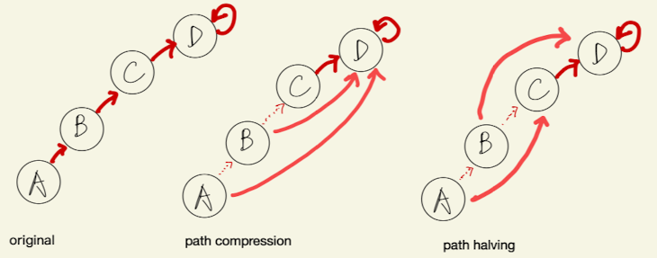

# [union–find data structure](https://en.wikipedia.org/wiki/Disjoint-set_data_structure)

- a.k.a disjoint set or merge–find
- Allow us to quickly identify whether a path exists between a given pair of vertices.
- Maintain a partition of a static set of objects. In the initial partition, each object is in its own set. These sets can merge over time, but they can never split.
- Just two operation as name suggests: union and find
- Union-find application in graph:
  - A union-find data structure is born with each object in a different set. Whenever a new edge (v, w) is added to the solution-so-far, the connected components of v and w fuse into one, and one Union operation suffices to update the union-find data structure accordingly. Checking whether an edge addition (v, w) would create a cycle is equivalent to checking whether v and w are already in the same connected component.
- Union-find data structure can be viewed as a disjoint-set forest consists of a pointer used to make parent pointer trees, where each node that is not the root of a tree points to its parent. Each tree represents a set stored in the forest, with the members of the set being the nodes in the tree. Root nodes provide set representatives: Two nodes are in the same set if and only if the roots of the trees containing the nodes are equal.

# `find`

- The Find operation follows the chain of parent pointers from a specified query node x until it reaches a root element. This root element represents the set to which x belongs and may be x itself. Find returns the root element it reaches.



## Path compression

- Performing a Find operation presents an important opportunity for improving the forest.
- The time in a Find operation is spent chasing parent pointers, so a flatter tree leads to faster Find operations.
- When a Find is executed, there is no faster way to reach the root than by following each parent pointer in succession. However, **the parent pointers visited during this search can be updated to point closer to the root. Because every element visited on the way to a root is part of the same set, this does not change the sets stored in the forest. But it makes future Find operations faster**, not only for the nodes between the query node and the root, but also for their descendants. This updating is an important part of the disjoint-set forest's amortized performance guarantee.

> NOTE: easily mess up: forget to `return parent_[nodeIdx] == nodeIdx? nodeIdx`, which would have caused an infinite loop.

```c++
// std::vector<int> parent_;
// parent_ = std::vector<int>(nodeCnt, -1);
int find(int nodeIdx) {
  if (parent_[nodeIdx] == -1) parent_[nodeIdx] = nodeIdx;
  return parent_[nodeIdx] == nodeIdx? nodeIdx
         : parent_[nodeIdx] = find(parent_[nodeIdx]); // the path compression
}
```

### Iterative way to do the find with path compression

```c++
//std::vector<int> parent_;
// NOTE: assume node point to itself as initialization!
//parent_ = std::iota(begin(parent_), end(parent_), 0);
int find(int nodeIdx) {
  int finalRoot = nodeIdx;
  while (finalRoot != parent_[finalRoot]) finalRoot = parent_[finalRoot];
  while (nodeIdx != finalRoot) {
    int oriParent = parent_[nodeIdx]; // store the original parent
    parent_[nodeIdx] = finalRoot; // assign parent as the final root
    nodeIdx = oriParent; // point to the original parent and keep doing it
  }
  return root;
}
```

## Path compression with path splitting/path halving

- assume node point to itself as initialization!
- "halving" because you keep pointing to grandparent
- This way retains the same worst-case complexity but are more efficient in practice

```c++
//std::vector<int> parent_;
// NOTE: assume node point to itself as initialization!
//parent_ = std::iota(begin(parent_), end(parent_), 0);
int find(int nodeIdx) {
  while (parent_[nodeIdx] != nodeIdx) {
    int oriParent = parent_[nodeIdx];       // store the original parent
    parent_[nodeIdx] = parent_[oriParent];  // point to grandparent basically
    nodeIdx = oriParent;
  }
  return nodeIdx;
}
```

# `union`

> NOTE: easily mess up - doing `parent_[x] = yRoot` or alike. No it's not, you
  are not just assign x's parent to y, you are point x's grandparent instead.

> Say A -> B; D -> E, you are trying to join A and D. If you only point
  parent[A] = E, it would be A -> E; D -> E; B -> B. e.g. B isn't connected to E
  like you intended to. But if you do `parent[parent[A]] = E; parent[B] = E`,
  then the graph becomes: A -> B -> E; D -> E.

```cpp
void unionJoin(int nodeX, int nodeY) {
  const auto xRoot = find(nodeX);
  const auto yRoot = find(nodeY);
  if (xRoot != yRoot) parent_[yRoot] = xRoot;
  // or
  // if (xRoot != yRoot) parent_[xRoot] = yRoot;
}
```
